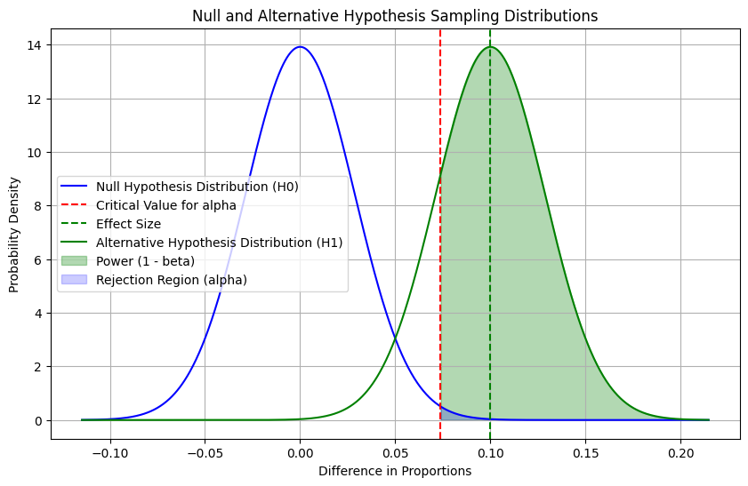

# ab_sample

An [app](https://jackattackyang-ab-sample-app-craeac.streamlit.app/) for calculating the sample size needed for a two sample proportion A/B test.

## Derivation
Two group comparison (equal sample size):
$$
n=(\frac{z_{\alpha/2}\cdot\sqrt{2 \cdot μ_{pooled}(1-μ_{pooled})}+z_\beta\cdot \sqrt{μ_0(1-μ_0)+μ_1(1-μ_1)}}{|μ_0-μ_1|})^2
$$

$$
μ_{pooled}=(μ_0+μ_1)/2
$$

Details

$$
μ_0 + z_{1−α/2}SE+z_{1-β}SE=μ_1
$$
When conducting a two sampled experiment, we may be sampling from the Null or the Alternate Distributions
- $H_0: μ_0-μ_1=0$: The Null hypothesis assumes no difference between the population means.
- $H_1: μ_0-μ_1=δ$: The Alternate hypothesis assumes a difference δ between the population means.

Significance Level ($\alpha$)

- The cutoff point at which $H_0$ is rejected is given by the significance level $α$, often split as $α/2$ for a two-tailed test.

Power ($1-\beta$)

- The power is probability of rejecting $H_0$ when $H_1$ is true.

$z_{1-\alpha/2}$
- Critical value from standard normal distribution where a significance level $\alpha$
- For $\alpha=0.05$, $z_{1-\alpha/2}=1.96$ for a standard normal curve

$z_{1-\beta}$
- Critical value for the power of the test $1-\beta$
- For $\beta=0.2$, $z_{1-\beta}=0.84$ for a standard normal curve

Standard Error
- $SE=\sigma\sqrt{\frac{2}{n}}$ or when variances and sample sizes are different $=\sqrt{\frac{\sigma_1}{n1}+\frac{\sigma_2}{n2}}$

Rearranging

$$
μ_0 + z_{1−α/2}\sigma\sqrt{\frac{2}{n}}+z_{1-β}\sigma\sqrt{\frac{2}{n}}=μ_1
$$

$$
μ_1-μ_0=(z_{1−α/2}+z_{1−β/2})\sigma\sqrt{\frac{2}{n}}
$$

$$
(μ_1-μ_0)^2=2(z_{1−α/2}+z_{1−β/2})^2\sigma^2/n
$$

$$
n=\frac{2\sigma^2(z_{1−α/2}+z_{1−β/2})^2}{(μ_1-μ_0)^2}
$$

Unequal group sizes, with $k=n2/n1$
$$
n_1=\frac{\sigma^2(z_{1−α/2}+z_{1−β/2})^2}{(μ_1-μ_0)^2(1+1/k)}
$$
$$
n_2=k\cdot n_1
$$
SE for unequal sample size
$$
SE=\sigma^2(\frac{1}{n_1}+\frac{1}{n_2})
$$
$$
SE=\sigma^2(\frac{1}{n_1}+\frac{1}{k\cdot n_1})=\sigma^2\frac{1+1/k}{n_1}
$$

## References
[Evan Miller's Online A/B Testing Tools](https://www.evanmiller.org/ab-testing/sample-size.html)

[Zhizhi Gewu](https://www.zhizhi-gewu.com/how-to-determine-the-sample-size-of-ab-test/)
